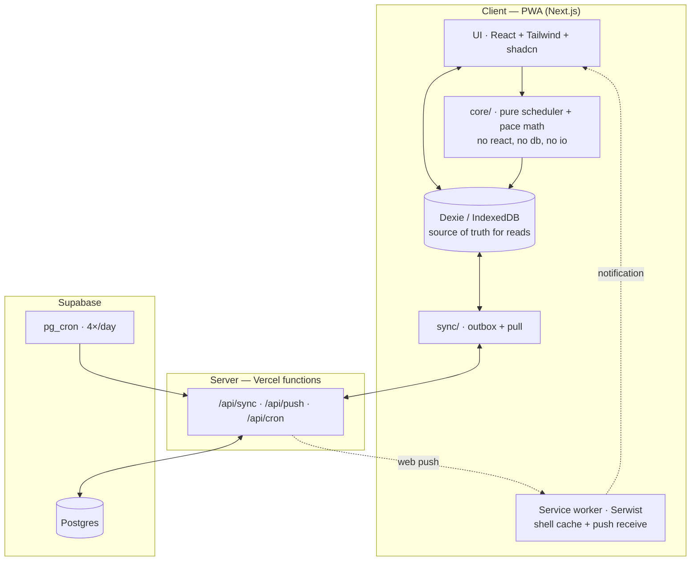

# my-time — Architecture

**Status:** draft for review.
**Reads with:** [`PRD.md`](./PRD.md) for *what*, [`DECISIONS.md`](./DECISIONS.md) for
*why*. `D-numbers` below cite decisions recorded there.

**Target platforms:** Windows desktop + Android, both Chrome. No iOS. Web Push works
natively on both, so PWA install is optional polish rather than required onboarding.

---

## 1. The one idea

**The UI never talks to the network.**

It reads and writes a local IndexedDB store, and nothing else. A separate sync layer
moves data between local and Postgres, on its own schedule, invisibly.

Offline therefore isn't a feature with edge cases — it is the only path the UI knows.
The network is the optional part. (D33)

This composes with a decision made earlier: layout is a **pure function** and the plan
is **derived state**, recomputable from goals plus history (D32, D34). So:

> **Check-in, plan generation, reconciliation and all pace math run entirely on the
> device.** The server is a sync target and a push sender. Nothing else.

## 2. Layers



Read the arrows carefully: **there is no arrow from UI to API.** That's the invariant
the whole design rests on, and §7 makes it enforceable.

## 3. Tech stack

| Layer | Choice | Why this one |
|---|---|---|
| Framework | **Next.js (App Router)** | Author's home turf; first-class on Vercel |
| Hosting | **Vercel Hobby** | Free; `main` auto-deploys; preview per branch (D40) |
| Service worker | **Serwist** | Maintained Workbox wrapper for Next; `next-pwa` is stale |
| Local store | **Dexie** (IndexedDB) | `useLiveQuery` makes local-as-source-of-truth natural |
| Database | **Supabase Postgres** | Free tier; relational fits the model; `pg_cron` (D37); auth ready for multi-user |
| Migrations / queries | **Drizzle** | Explicit, reviewable migrations — required by D29 |
| Styling | **Tailwind + shadcn/ui** | Fast; `design.md` layers tokens on top |
| Push | **Web Push** (`web-push`) | Subscriptions in Postgres |
| Scheduling | **Supabase `pg_cron`** | Vercel Hobby cron is once/day, ±59 min — verified unusable (D37) |
| Testing | **Vitest** | Fast; the pure core is the thing worth testing |

Deliberately absent: no job queue, no worker, no Redis, no realtime subscriptions, no
state-management library. Re-layout is a synchronous pure function over ~15 goals
(D32); Dexie live queries are the state layer.

## 4. The scheduler — module boundary

This is the only genuinely hard code in the app, so its edges are defined tightly.
Everything in `src/core/` is **pure**: no React, no Dexie, no `fetch`, no `Date.now()`
read internally — the clock is an input.

### 4.1 Signature

```ts
// core/layout.ts — places sessions across a rolling week (D16)
layoutWeek(input: {
  goals:      Goal[]          // active only, with stages
  dayparts:   Daypart[]       // user boundaries + per-daypart cap (D7, D11)
  history:    SessionLog[]    // append-only facts, for cadence debt + staleness
  existing:   PlanSlot[]      // current placements — preferred, to minimise churn (D32)
  weekStart:  IsoDate
}): PlanSlot[]

// core/reconcile.ts — adapts one daypart to the time actually available (D8)
reconcileDaypart(input: {
  slots:            PlanSlot[]      // planned for this daypart
  availableMinutes: number          // stated by the user at check-in
  now:              IsoDateTime
}): { keep: PlanSlot[]; dropped: PlanSlot[] }

// core/pace.ts — the two "on track" questions (D25)
cadenceStatus(stage, history, now): { requiredPerDay, actualPerDay, feasible }
scopeStatus(stage, checkpoints, now): { requiredPerUnit, measuredPerUnit, projection? }

// core/explain.ts — D14
explainSlot(slot, context): string   // "3rd of 4 gym sessions, 3 days left — morning is its only slot"
```

### 4.2 Rules the implementation must honour

1. **Deterministic.** Same inputs → identical output, always. No randomness, no ambient
   clock. Note this is *not* sufficient for two devices to agree, because `existing` is
   itself an input — which is exactly why the plan syncs (§5.2, D45).
2. **Recompute, never patch.** Every trigger — missed session, goal activated, cadence
   edited, daypart moved — is just "inputs changed, regenerate." Idempotent, so racing
   recomputes are harmless. (D32)
3. **The past is immutable.** Layout may only produce slots for *future* dates.
   `SessionLog` rows are facts and are never rewritten. (D32)
4. **Minimise churn.** `existing` slots are honoured wherever still valid. A trivial
   change must not reshuffle a day the user has already read. Stability is a feature,
   not an optimisation. (D32)
5. **Scarcity first.** Stages with fewer eligible dayparts are placed before stages
   with more. Yoga claims morning before meditation, which has an evening to fall back
   on. (D9)
6. **Pack, don't sort.** Reconciliation is a small knapsack, not a greedy truncation:
   three 30-minute sessions may beat one 60-minute session in 90 minutes. Sizes are
   fixed (D12) and counts are tiny, so exact packing is cheap.
7. **No partial sessions.** A box that doesn't fit isn't scheduled. (D27)
8. **Every slot carries its reason.** (D14)

### 4.3 Scoring

`tier × pressure × scarcity`, where pressure combines cadence debt, deadline pressure,
and staleness. **Coefficients live in one exported constant object** and are expected
to be wrong initially — they get tuned once the app is in daily use. Keeping them in
one place, not scattered through the algorithm, is the requirement.

## 5. Data model

Per D29 the schema models the **full decided design** from the first migration, even
where v1 leaves a table holding one implicit row. Deferred features are *gated in the
UI*, not missing from the database — so v2 is additive rather than a migration.

Two classes of table:

- **Synced** — mirrored between IndexedDB and Postgres. Almost everything, including the
  plan itself (§5.2).
- **Local-only** — never leaves the device. Only the outbox, which is purely a transport
  detail.

| Table | Class | Purpose |
|---|---|---|
| `users` | synced | One row in v1. Exists so auth is additive, not a rewrite. |
| `dayparts` | synced | User-defined boundaries + per-daypart active cap (D7, D11) |
| `goals` | synced | Name, purpose, priority tier, lifecycle state |
| `goal_cycles` | synced | Review date, acceptance criteria, verdict, decision (D4) — **v1 writes, UI deferred** |
| `stages` | synced | The scheduling unit: time-box, cadence, eligibility, scope (D23) |
| `session_logs` | synced, **append-only** | What actually happened. Facts. |
| `checkpoints` | synced, **append-only** | Coarse progress — "chapter 7" (D13) |
| `check_ins` | synced, **append-only** | Daypart + available minutes stated by user |
| `push_subscriptions` | synced | Web Push endpoints per device |
| `plan_slots` | **synced, atomic per week** | The week's placements. Derived, but synced — see §5.2 (D45) |
| `outbox` | **local-only** | Pending writes awaiting sync |

### 5.1 Key columns

**`stages`** — carries everything schedulable, because the stage is the unit (D19b, D23):

| Column | Note |
|---|---|
| `session_minutes` | Fixed time-box (D12) |
| `cadence_type` | `frequency` \| `fixed_days` \| `hybrid` (D26) |
| `cadence_count` | Sessions per week |
| `cadence_days` | Weekday set, nullable — for `fixed_days` / `hybrid` |
| `eligible_dayparts` | A **set**, not one value (D7) |
| `max_per_week` | Hard recovery ceiling (D20) |
| `min_rest_days` | Optional rest gap (D20) |
| `scope_unit_label` | e.g. `"chapter"`, nullable |
| `scope_unit_total` | e.g. `30`, nullable — enables the target-date line (D28) |
| `target_date` | Nullable |
| `deadline_derived` | Set when computed backwards from a later stage (D24, v2) |
| `sort_order`, `state` | Stage sequence and progress |

**`session_logs`** — `stage_id`, `date`, `daypart_id`, `minutes`, `status`
(`done` | `skipped`), `source` (`planned` | `voluntary`), `logged_at`.

`source = voluntary` is how catch-up gets credited against the ideal line without ever
being imposed as debt (D20).

### 5.2 Why the plan syncs, even though it's derived

Offline-first does **not** mean device-local. Check in on the phone, open the laptop,
and every surface must already agree — with no sync button anywhere. (D45, D46)

Determinism is not sufficient for this, and the reason is easy to miss:

- Reconciliation depends on **available minutes**, which you *state* at check-in. That's
  a fact rather than a derivation — but it's already a synced append-only row
  (`check_ins`), so it travels.
- Layout takes `existing` placements as an input, in order to minimise churn (D32).
  That makes layout **path-dependent**. Two devices holding different local `existing`
  state will legitimately compute different plans. A pure function doesn't help you when
  an input differs.

So `plan_slots` syncs. **Atomically per week** — one version stamp for the whole week,
latest wins wholesale. Per-slot LWW would interleave two devices' plans into something
incoherent. If two offline devices both re-lay-out, one loses entirely, which is fine:
the plan is derived, not precious.

### 5.3 A note on stages vs cycles

`stages.goal_id` — stages hang off the goal, not the cycle. Simpler, and it matches
"cadence swappable without recreating the goal" (D26). **Cost:** renewing a cycle with
a changed protocol doesn't preserve what the protocol used to be. Accepted for v1;
revisit if historical protocol comparison ever matters.

## 6. Sync

Hand-rolled sync is normally a trap. It isn't here, because of what actually needs
syncing (D35):

| Data | Shape | Resolution |
|---|---|---|
| `session_logs`, `checkpoints`, `check_ins` | append-only | **union** — no conflict possible |
| `goals`, `stages`, `dayparts`, `settings` | small, rare edits, single user | **last-write-wins** on `updated_at` |
| `plan_slots` | derived, but path-dependent (§5.2) | **LWW per week, atomic** (D45) |

So: an outbox queue on the client, LWW on the server. Roughly two endpoints.

```
POST /api/sync   { since, changes[] }  →  { serverChanges[], serverTime }
```

Flush triggers: app foreground, network regained, and after any local write (debounced).
Failure is not an error state — the outbox retains rows and retries. **The user is never
blocked by sync**, because the UI was never waiting on it.

### 6.1 Sync status is always visible

There is no sync button (D46). But the state is permanently on screen — a small
persistent indicator, not a transient toast:

| State | Meaning |
|---|---|
| **synced** | outbox empty, last pull recent |
| **syncing** | flush or pull in flight |
| **offline** | no network; writes queuing normally |
| **n pending** | outbox depth, when non-zero |

Same pattern as free-slot visibility (D31): *show the fact, never prompt the action.*
The user should never wonder whether their devices agree, and never have to do anything
about it.

### 6.2 Performance rules (D47)

Never load a whole list. `session_logs`, `checkpoints` and the missed-session view all
grow without bound, so:

- **Bounded Dexie queries only** — indexed ranges, never `.toArray()` on a growing table.
- **Paginated or virtualised lists** for history and missed sessions.
- **Route-level code splitting**; defer anything below the fold.
- Local IndexedDB keeps a **bounded recent window**; the server keeps everything (D48).

This erodes one convenient `.toArray()` at a time, so it is also a standing rule in
`CLAUDE.md`.

## 7. Enforcing the invariant

The whole design rests on the UI not reaching the network, and on `core/` staying pure.
Both are easy to violate accidentally, so they get mechanical guards — detailed in root
`CLAUDE.md` (which replaces the planned `rules.md`, since Claude Code auto-loads only
`CLAUDE.md` — D49):

- `src/core/**` may not import from `db/`, `app/`, `sync/`, or `react`.
- `src/features/**` and `src/app/**` (client components) may not import from
  `db/server/`, and may not call `fetch` — only `sync/` and route handlers may.
- ESLint `no-restricted-imports` boundaries, checked in CI.

## 8. Folder structure

```
my-time/
├── CLAUDE.md                 root, auto-loaded by Claude Code: hard rules + pointers (D49)
├── docs/                     PRD, Architecture, Phases, design, memory, DECISIONS
├── drizzle/                  generated SQL migrations (reviewed, committed)
├── public/
│   ├── manifest.webmanifest
│   └── icons/
├── src/
│   ├── app/                          Next.js App Router
│   │   ├── page.tsx                  today + check-in — the default surface
│   │   ├── plan/page.tsx             the week
│   │   ├── goals/
│   │   │   ├── page.tsx              list, incl. planned backlog + free-slot counts (D31)
│   │   │   ├── new/page.tsx
│   │   │   └── [id]/page.tsx         detail: cadence, scope, required vs actual
│   │   ├── missed/page.tsx           killed sessions, always visible (D20)
│   │   ├── settings/page.tsx         daypart boundaries, per-daypart caps
│   │   └── api/
│   │       ├── sync/route.ts
│   │       ├── push/subscribe/route.ts
│   │       └── cron/remind/route.ts  called by pg_cron; sends content-free nudge (D37b)
│   ├── core/                 ★ PURE. no react, no db, no io, no clock
│   │   ├── types.ts
│   │   ├── layout.ts                 week layout (D16)
│   │   ├── reconcile.ts              check-in packing (D8)
│   │   ├── score.ts                  cadence debt · staleness · scarcity (D9)
│   │   ├── pace.ts                   required vs actual · projection (D25)
│   │   ├── explain.ts                one-line reasons (D14)
│   │   └── constants.ts              all tunable coefficients, in one place
│   ├── db/
│   │   ├── local/                    Dexie: schema, queries, outbox
│   │   └── server/                   Drizzle: schema, client
│   ├── sync/                         push · pull · engine
│   ├── features/                     UI by domain: checkin · goals · plan · settings
│   ├── components/ui/                shadcn primitives
│   └── lib/
│       ├── daypart.ts                boundary math — "which daypart is it now?"
│       ├── push.ts                   subscription helpers
│       └── ai/                       v2 seam only: provider interface, no impl (D39)
└── tests/core/                       scheduler + pace unit tests
```

## 9. App flow

### 9.1 First run

Set daypart boundaries and per-daypart caps → create goals (name, purpose, tier,
cadence, eligible dayparts, time-box, optional scope) → layout runs → the week exists.

### 9.2 The daily loop

```
open app
  → lib/daypart.ts identifies the current daypart and states it
  → planner.reconcileNow({ availableMinutes: null }) — every planned session, ranked,
    nothing dropped, each with its reason                                          (D14)
  → surface states the gap: minutes required for this daypart · minutes left in it  (D8)
  → user taps done / skipped per item                                        (one tap)
  → session_logs appended; outbox queued; layout regenerates future slots only
```

**"Adjust today" is a detour off that line, not a step on it** (D63). It writes a
`check_ins` row and re-runs the same `reconcileNow` with a real number, which is what
puts anything into "won't fit":

```
user opens "Adjust today"
  → corrects the daypart if it is wrong; sees D8's four numbers
  → states available minutes
  → putCheckIn appends the row; outbox queued
  → planner.reconcileNow({ availableMinutes: stated − already logged })
  → core/reconcile.ts packs what fits; the rest renders read-only            (D27)
```

The stated minutes are read back from the `check_ins` row rather than held in
component state, so a reload or a backgrounded PWA resumes with it intact. Time
already spent is derived from the day's `session_logs`, not decremented in memory.

Every step of this works offline.

### 9.3 The other paths

- **Missed** — an unlogged session past its daypart is `missed`. It **dies** and
  surfaces in `/missed`. Nothing is dragged forward. (D20)
- **Voluntary catch-up** — log a session that wasn't planned; recorded with
  `source = voluntary` and credited against the ideal line. Blocked by
  `max_per_week` / `min_rest_days` where set. (D20)
- **Checkpoint** — occasional coarse prompt: *"which chapter are you on?"* Feeds the
  measured-pace projection. (D13)
- **Reminder** — `pg_cron` hits `/api/cron/remind` at each daypart boundary; server
  sends a **content-free** nudge, because it doesn't compute the plan. (D37b)
- **Sync** — invisible. Outbox flushes when it can.

## 10. Deployment

`main` → Vercel production, from the very first commit. Branches → preview URLs. A
deployable skeleton ships **before** any feature work, so `Phases.md` opens with deploy
rather than closing with it. (D40)

Environment: Supabase connection string (pooler URL, for serverless), VAPID keypair for
Web Push, cron shared secret.

## 11. Open

- ~~Daypart boundary changes~~ → **resolved (D44):** editing boundaries at any time
  re-lays out the remainder of the day and week. Already-logged sessions keep the
  `daypart_id` they were recorded against — the past is immutable.
- ~~Retention~~ → **resolved (D48):** the server keeps everything until free-tier
  pressure; local keeps a bounded recent window (D47).
- **First-run seeding.** Sensible default daypart boundaries, or make the user set them?
  *(Leaning: seed sensible defaults, since an empty settings screen is a bad first
  impression — and boundaries are editable anyway.)*
